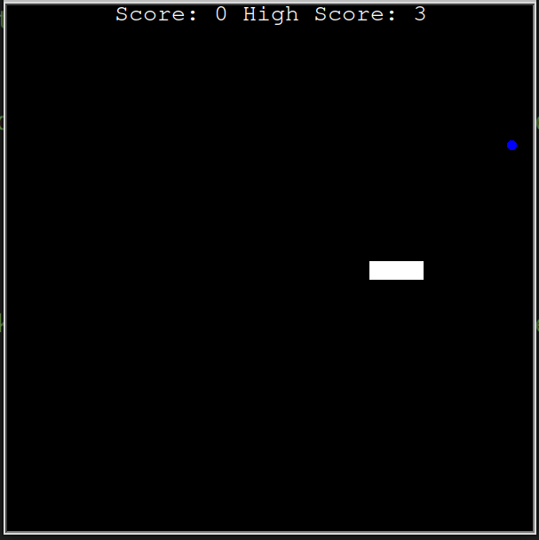

# Retro Snake Game!
This app was build using the Turtle libray.

## Getting Started
Clone this repo or download. Once downloaded, open in any IDE of your choice.

Once opened, hit the play button (normally in the top right corner).

## Gameplay
Use the arrow keys on your keyboard to move the snake. If you hit an apple, illustrated as a blue cicle on the screen, the snake will grow by one square. Once the snake hits itself or the wall, you will respawn in the 0,0 position, right in the middle of the screen.

## Screenshots

### In game screenshot



## App Development
Object Oriented Programming was used for instances of the scoreboard, when the snake moves or changes, and the apple or 'food'. 

To keep track of the current score, the Turtle class is extended to make use of some of the methods.

```python
class Scoreboard(Turtle):

    def __init__(self):
        super().__init__()
        self.score = 0
        self.highscore = 0
        # hides the tracer and the initial turtle shape
        self.hideturtle()
        self.penup()
        self.color("white")
        # moves to a location at the top of the screen
        self.goto(0, 320)
        # runs the update_score method
        self.update_score()
        ...
```

Updating the scoreboard using `def update_score`, increasing the scores counter `def counter` and updating the highscore `def high_score` were methods added to the `Scoreboard` class. NOTE: `update_score` reads from the `high_score.txt` file storing the previously saved high score through `mode='r`. `high_score` checks the current score for a new high score and overwrites the current addition using `mode=w`if this condition is met. 

```python
    def update_score(self):
        # writes the variables to the screen. Clear screen was added in here. This is because the game_over method is
        # not being used anymore. this wasn't previously reset because the score stayed in the screen when the game
        # finished.
        self.clear()
        with open("high_score.txt", mode="r") as h_score:
            high_score = h_score.read()
        self.write(f"Score: {self.score} High Score: {high_score}", True, align=ALIGNMENT, font=FONT)

    def counter(self):
        self.score += 1
        self.goto(0, 270)
        self.update_score()

    def high_score(self):
        # updating the high score when the current score is higher at the end of the game
        if self.score > self.highscore:
            with open("high_score.txt", mode="w") as h_score:
                h_score.write(f"{self.score}")
        # reset the game score
        self.score = 0
        # reset the position to the center top location. Otherwise, the score will move off screen
        self.goto(0, 270)
        # start the score_update() method all over again
        self.update_score()
```
The `Snake` class defines the methods used for movememnt and all other physical characterisitics. For example, the `def grow()` method will take the current position of the last block in the snake, instatinate a new block and then add it to the tail of the snake.

```python
    ...
    def grow(self):
        # Storing the xy coordinates of the last positon.
        last_square_x = self.square_list[len(self.square_list) - 1].xcor()
        last_square_y = self.square_list[len(self.square_list) - 1].ycor()
        # Instantiating a new square and calling it the tail (where we will grow the snake).
        tail_square = Turtle("square")
        tail_square.color("white")
        tail_square.penup()
        # Using the Turtle library to move the square to the stored coordinates.
        tail_square.goto(last_square_x, last_square_y)
        # Finally, appending the square.
        self.square_list.append(tail_square)
        ...
```

`Food` class is a representation of the apple in the game. Again, this extends the `Turtle` class to make use of some standard methods. This can be seen from the code snippet below:

```python
class Food(Turtle):
    def __init__(self):
        super().__init__() # calling the Turtle class the super class. All attributes/methods can be used here now
        self.shape("circle")
        self.penup()
        self.shapesize(stretch_len=0.5, stretch_wid=0.5)
        self.color("blue")
        self.speed("fastest")
        self.new_loc()
        ...
```

`.randint` is used to place the food in a new random location once the previous one has been eaten. The `new_loc` method takes care of this.

```python
...
    def new_loc(self):
        random_x = random.randint(-280, 280)
        random_y = random.randint(-280, 280)
        self.goto(random_x, random_y)
```

Finally, in the `main.py`, after configuration and instantiation, we have three conditionals for collision detection. First, we check for food collision, wall collision and collision with self

```python
...
    if snake.head.distance(food) < 15:
        # we are using the attribute defined as "head" (snakes head) to check if its less
        # than 15 pixels away from the food. This will mean it is close enough to call it a collision. Distance is a
        # method from the Turtle class
        snake.grow()
        # moving the food to a random location
        food.new_loc()
        score.counter()

    if snake.head.xcor() > 280 or snake.head.xcor() < -280 or snake.head.ycor() > 280 or snake.head.ycor() < -280:
        # updating the high score
        score.high_score()
        # resetting the position of the starting snake (three squares)
        snake.reset_pos()

    for squares in snake.square_list[1:]:
        # this is so that if any of the squares get within 15 pixels of each other,
        # its game over
        if snake.head.distance(squares) < 5:
            # same as above for high score
            score.high_score()
            snake.reset_pos()
            # score.game_over()
...
```

## Challenges
This game was originally developed in 2021. After revisiting in 2023, `tkinter` module went through an update. The development of the the module moved to a new repository and required it to be installed locally in order for it to be run with this application. 


